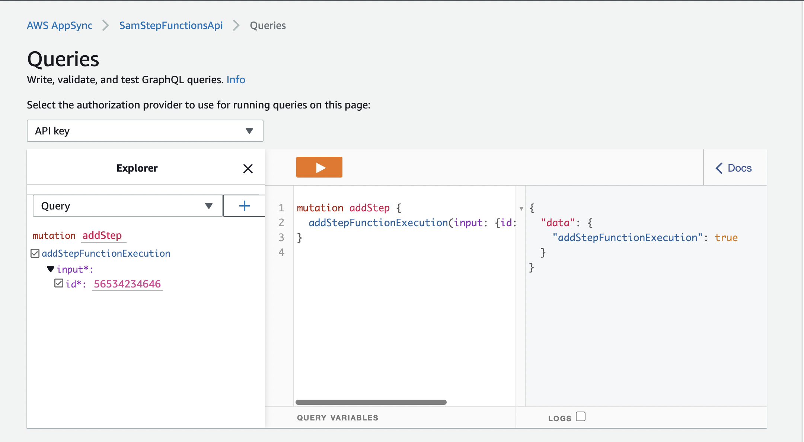
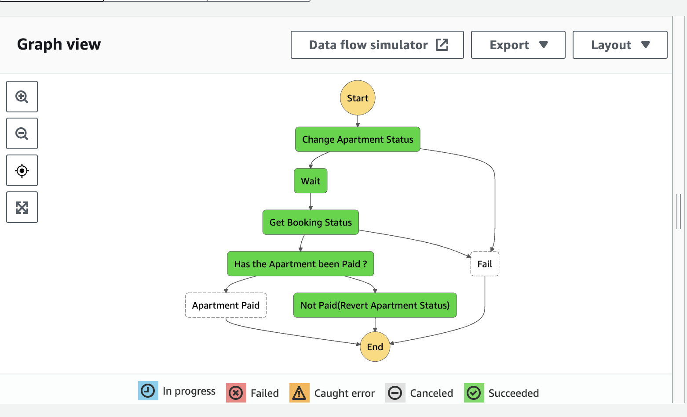

# Invoking step functions workflows using appsync and direct lambda resolvers

This SAM templates deploys an AWS Appsync API,a DynamoDB table and a step functions workflow.
You can invoke the step functions workflow by sending a random Id number as input to a mutation in the appsync api

## Deployment Instructions

1. Create a new directory, navigate to that directory in a terminal and clone the GitHub repository:
    ``` 
    git clone https://github.com/aws-samples/serverless-patterns
    ```
1. Change directory:
    ```
     cd appsync-lambda/
    ```
1. From the command line, use AWS SAM to deploy the AWS resources for the pattern as specified in the template.yml file:
    ```
    sam deploy --guided
    ```
1. During the prompts:
    * Enter a stack name
    * Enter the desired AWS Region
    * Allow SAM CLI to create IAM roles with the required permissions.


## Testing
Sign in to your AWS console and search for appsync. Open up appsync and click on your newly deployed appsync project.





## Cleanup
 
1. Delete the stack
    ```bash
    aws cloudformation delete-stack --stack-name STACK_NAME
    ```
1. Confirm the stack has been deleted
    ```bash
    aws cloudformation list-stacks --query "StackSummaries[?contains(StackName,'STACK_NAME')].StackStatus"
    ```
----
Copyright 2021 Amazon.com, Inc. or its affiliates. All Rights Reserved.

SPDX-License-Identifier: MIT-0
